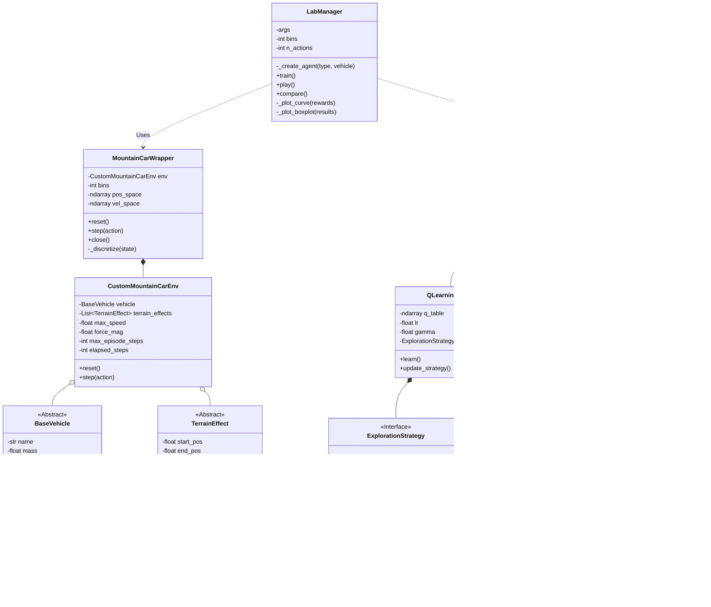

```mermaid
classDiagram
    %% ==========================================
    %% Part A: 物理世界 (World)
    %% ==========================================
    class BaseVehicle {
        <<Abstract>>
        -str name
        -float mass
        -float engine_power_factor
        -float _max_speed
        +get_max_speed() float
    }

    class SportCar {
        +__init__()
    }

    class Truck {
        +__init__()
    }

    class TerrainEffect {
        <<Abstract>>
        -float start_pos
        -float end_pos
        -str name
        +is_in_zone(pos) bool
        +apply_effect(velocity) float
    }

    class BoostZone {
        -float factor
        +apply_effect(velocity)
    }

    class MudZone {
        -float factor
        +apply_effect(velocity)
    }

    class CustomMountainCarEnv {
        -BaseVehicle vehicle
        -List~TerrainEffect~ terrain_effects
        -float max_speed
        -float force_mag
        -int max_episode_steps
        -int elapsed_steps
        +reset()
        +step(action)
    }

    %% 關係
    BaseVehicle <|-- SportCar
    BaseVehicle <|-- Truck
    TerrainEffect <|-- BoostZone
    TerrainEffect <|-- MudZone
    CustomMountainCarEnv o-- BaseVehicle
    CustomMountainCarEnv o-- TerrainEffect

    %% ==========================================
    %% Part B: 智能體大腦 (Brain)
    %% ==========================================
    class ExplorationStrategy {
        <<Interface>>
        +select_action(q_values, n_actions)
        +update()
    }

    class EpsilonGreedyStrategy {
        -float epsilon
        -float min_epsilon
        -float decay_rate
        +select_action(q_values, n_actions)
        +update()
    }

    class Agent {
        <<Abstract>>
        -str name
        -int n_actions
        +choose_action(state)
        +learn(state, action, reward, next_state)
        +save(filename)
        +load(filename)
    }

    class QLearningAgent {
        -ndarray q_table
        -float lr
        -float gamma
        -ExplorationStrategy strategy
        +learn()
        +update_strategy()
    }

    class SarsaAgent {
        +learn()
    }

    class RuleBasedAgent {
        +choose_action()
    }

    class RandomAgent {
        +choose_action()
    }

    %% 關係
    ExplorationStrategy <|-- EpsilonGreedyStrategy
    Agent <|-- QLearningAgent
    Agent <|-- RuleBasedAgent
    Agent <|-- RandomAgent
    QLearningAgent <|-- SarsaAgent
    QLearningAgent *-- ExplorationStrategy

    %% ==========================================
    %% Part C: 管理層 (Manager)
    %% ==========================================
    class MountainCarWrapper {
        -CustomMountainCarEnv env
        -int bins
        -ndarray pos_space
        -ndarray vel_space
        +reset()
        +step(action)
        +close()
        -_discretize(state)
    }

    class LabManager {
        -args
        -int bins
        -int n_actions
        -_create_agent(type, vehicle)
        +train()
        +play()
        +compare()
        -_plot_curve(rewards)
        -_plot_boxplot(results)
    }

    %% 關係
    MountainCarWrapper *-- CustomMountainCarEnv
    LabManager ..> MountainCarWrapper : Uses
    LabManager ..> Agent : Creates
```
